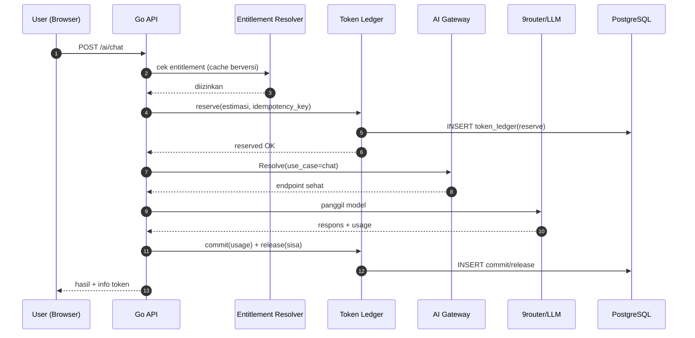
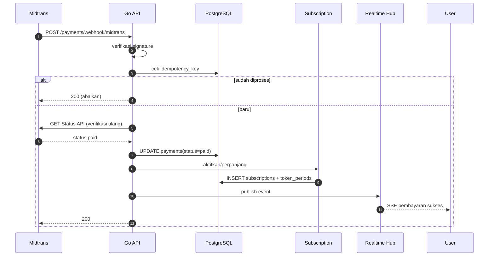
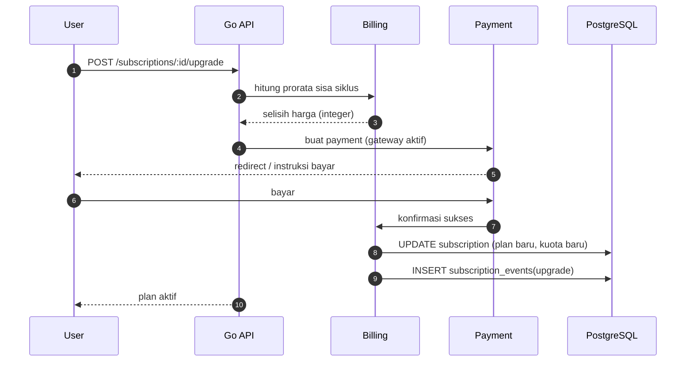
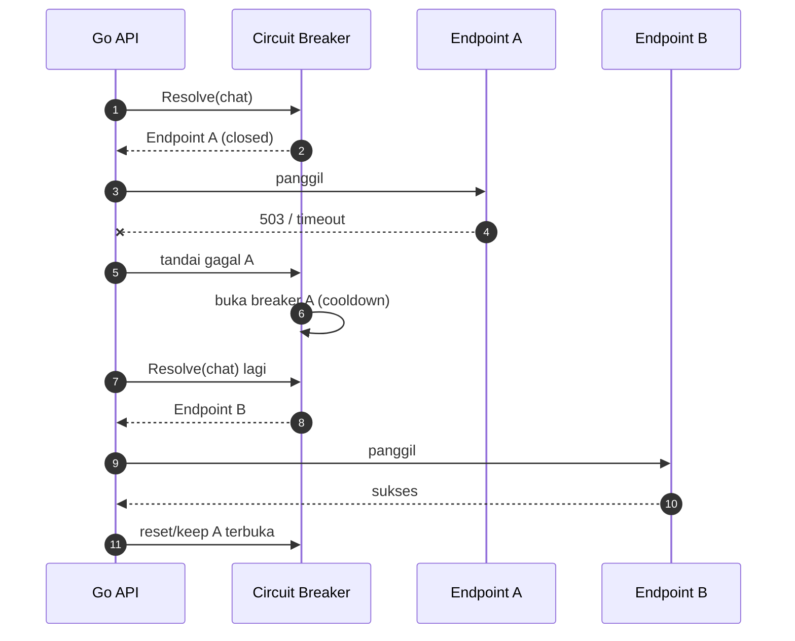

# Diagram — Sequence FinTrack v2

## 1. Pemakaian AI dengan Metering Token

```mermaid
sequenceDiagram
    autonumber
    participant U as User (Browser)
    participant API as Go API
    participant ENT as Entitlement Resolver
    participant LED as Token Ledger
    participant GW as AI Gateway
    participant R9 as 9router/LLM
    participant DB as PostgreSQL

    U->>API: POST /ai/chat
    API->>ENT: cek entitlement (cache berversi)
    ENT-->>API: diizinkan
    API->>LED: reserve(estimasi, idempotency_key)
    LED->>DB: INSERT token_ledger(reserve)
    LED-->>API: reserved OK
    API->>GW: Resolve(use_case=chat)
    GW-->>API: endpoint sehat
    API->>R9: panggil model
    R9-->>API: respons + usage
    API->>LED: commit(usage) + release(sisa)
    LED->>DB: INSERT commit/release
    API-->>U: hasil + info token
```

## 2. Webhook Pembayaran Midtrans (idempoten)

```mermaid
sequenceDiagram
    autonumber
    participant MT as Midtrans
    participant API as Go API
    participant DB as PostgreSQL
    participant SUB as Subscription
    participant SSE as Realtime Hub
    participant U as User

    MT->>API: POST /payments/webhook/midtrans
    API->>API: verifikasi signature
    API->>DB: cek idempotency_key
    alt sudah diproses
        API-->>MT: 200 (abaikan)
    else baru
        API->>MT: GET Status API (verifikasi ulang)
        MT-->>API: status paid
        API->>DB: UPDATE payments(status=paid)
        API->>SUB: aktifkan/perpanjang
        SUB->>DB: INSERT subscriptions + token_periods
        API->>SSE: publish event
        SSE-->>U: SSE pembayaran sukses
        API-->>MT: 200
    end
```

## 3. Upgrade Prorata

```mermaid
sequenceDiagram
    autonumber
    participant U as User
    participant API as Go API
    participant BIL as Billing
    participant PAY as Payment
    participant DB as PostgreSQL

    U->>API: POST /subscriptions/:id/upgrade
    API->>BIL: hitung prorata sisa siklus
    BIL-->>API: selisih harga (integer)
    API->>PAY: buat payment (gateway aktif)
    PAY-->>U: redirect / instruksi bayar
    U->>PAY: bayar
    PAY->>BIL: konfirmasi sukses
    BIL->>DB: UPDATE subscription (plan baru, kuota baru)
    BIL->>DB: INSERT subscription_events(upgrade)
    API-->>U: plan aktif
```

## 4. Failover AI Gateway

```mermaid
sequenceDiagram
    autonumber
    participant API as Go API
    participant CB as Circuit Breaker
    participant E1 as Endpoint A
    participant E2 as Endpoint B

    API->>CB: Resolve(chat)
    CB-->>API: Endpoint A (closed)
    API->>E1: panggil
    E1--xAPI: 503 / timeout
    API->>CB: tandai gagal A
    CB->>CB: buka breaker A (cooldown)
    API->>CB: Resolve(chat) lagi
    CB-->>API: Endpoint B
    API->>E2: panggil
    E2-->>API: sukses
    API->>CB: reset/keep A terbuka
```
